# electron-vite-app

An Electron application with Vue and TypeScript

## Recommended IDE Setup

- [VSCode](https://code.visualstudio.com/) + [ESLint](https://marketplace.visualstudio.com/items?itemName=dbaeumer.vscode-eslint) + [Prettier](https://marketplace.visualstudio.com/items?itemName=esbenp.prettier-vscode) + [Volar](https://marketplace.visualstudio.com/items?itemName=Vue.volar)

## Project Setup

### Install

```bash
$ pnpm install
```

### Development

```bash
$ pnpm dev
```

### Build

```bash
# For windows
$ pnpm build:win

# For macOS
$ pnpm build:mac

# For Linux
$ pnpm build:linux
```

## electron learn

### electron架构

#### 主进程 (Main Process)

- 是什么？
  主进程是 Electron 应用程序的入口点和心脏。每个 Electron 应用有且`只有一个`主进程。它实际上是一个完整的 `Node.js 环境`。

- 职责和能力:
  - 应用生命周期管理：通过 app 模块控制应用的启动、退出、激活等事件。
  - 创建和管理窗口：使用 BrowserWindow 模块来创建和控制应用的图形界面窗口（即渲染进程）。
  - 访问原生 API：可以直接使用所有 Node.js 的 API（如 fs 读写文件、path 处理路径、child_process 创建子进程）和 Electron 提供的原生 API（如 dialog 创建系统对话框、Menu 创建菜单栏、Tray 创建系统托盘图标）。
  - 作为所有渲染进程的协调者：它是所有渲染进程的父进程，负责它们之间的通信（IPC）和管理。

- 关键点:
  - 没有 UI：主进程不渲染任何可见的界面。它在后台运行
  - 入口文件：package.json 中的 main 字段指定的文件就是主进程的脚本
  - 环境：纯 Node.js 环境，不能访问浏览器特有的 API，如 window、document、DOM

- 处理流程:



---

#### 渲染进程 (Renderer Process)

- 是什么？
  - 渲染进程是应用中的一个`浏览器窗口`。它的主要工作是使用 HTML, CSS, 和 JavaScript 来展示用户界面。它本质上是一个 `Chromium 浏览器环境`。
- 职责和能力:
  - 构建用户界面：使用熟悉的 Web 技术（React, Vue, Svelte,原生JS等）来创建交互式界面
  - 与用户交互：响应用户的点击、键盘输入等事件
  - 使用 Web API：可以访问所有标准的浏览器 API，如 DOM 操作、fetch、Canvas、Web Audio 等
- 关键点:
  - 多进程：一个 Electron 应用可以有多个渲染进程（例如，多个窗口、或者一个窗口内的 <webview>）
  - 安全沙箱：出于安全考虑，默认情况下，渲染进程不能直接访问 Node.js API 或操作系统资源。这就是为什么我们需要预加载脚本。这个安全特性被称为上下文隔离 (Context Isolation)

---

#### 预加载脚本 (Preload Script)

- 是什么？
  - 预加载脚本是一个在渲染进程的 Web 内容开始加载之前，运行在`渲染进程内部`的特殊脚本。它虽然运行在渲染进程中，但拥有一个`特权环境`
- 职责和能力:
  - 安全桥梁：它的核心使命是作为主进程和渲染进程之间的安全通信桥梁
  - 特权访问：它同时可以访问浏览器 API（如 window, document）和 Node.js API（如 require, process）
  - 暴露 API 给渲染进程：通过 Electron 的 contextBridge 模块，它可以安全地将主进程或 Node.js 的功能封装成函数，并暴露给渲染进程的 window 对象，供其调用
- 关键点：
  - 上下文隔离 (Context Isolation)：即使 preload.js 可以访问 Node.js，contextBridge 也能确保你暴露给渲染进程的函数和变量不会被渲染进程的第三方脚本篡改，从而保证了安全
  - 不是注入全部：绝对不要直接把 require 或整个 ipcRenderer 对象暴露给渲染进程，这是非常危险的。只暴露你需要的最少功能

---

#### 总结

| 特性            | 主进程 (Main Process)             | 渲染进程 (Renderer Process) | 预加载脚本 (Preload Script)    |
| :-------------- | :-------------------------------- | :-------------------------- | :----------------------------- |
| **数量**        | 只有一个                          | 可以有多个                  | 每个渲染进程一个               |
| **环境**        | Node.js                           | Chromium 浏览器             | 特殊的混合环境                 |
| **UI**          | ❌ 没有                           | ✅ 有，负责渲染             | ❌ 没有                        |
| **Node.js API** | ✅ 完全访问                       | ❌ 默认无权限               | ✅ 完全访问                    |
| **DOM/Web API** | ❌ 无法访问                       | ✅ 完全访问                 | ✅ 完全访问                    |
| **主要职责**    | 应用管理、系统交互                | 用户界面、用户交互          | 安全桥梁，连接主进程和渲染进程 |
| **核心模块**    | `app`, `BrowserWindow`, `ipcMain` | `(无特定)`, 使用Web技术     | `contextBridge`, `ipcRenderer` |

### electron进程间的通信

#### 核心原则

由于安全原因（上下文隔离），渲染进程不能直接与主进程对话。所有通信都必须通过预加载脚本这个“安全中介”

#### 核心通信模块

- ipcMain (Inter-Process Communication Main)
  - 运行在`主进程`中。它像一个总机，负责接收和响应来自所有渲染进程的消息
- ipcRenderer (Inter-Process Communication Renderer)
  - 运行在`渲染进程和预加载脚本`中。它像一部电话，可以用来呼叫总机（ipcMain）或者接听来自总机的电话
- contextBridge
  - 运行在`预加载脚本`中。它是安全的桥梁搭建工具，能将预加载脚本中的特权功能（如 ipcRenderer）安全地暴露给渲染进程

#### 通信场景

##### 渲染进程 → 主进程（双向通信）

最常见的场景：渲染进程需要主进程做某件事（如读文件、打开对话框），并**等待一个结果**。

这种模式就像**打电话**：你拨号，等待对方接听，说完事，然后等待对方的答复。

我们使用 `invoke` / `handle` 组合来实现。

**运作流程图:**

```
[用户点击] --> [1. Renderer.js] --> [2. Preload.js] --> [3. IPC Channel] --> [4. Main.js]
   ^                                                                            |
   |                                                                            |
[7. UI更新] <-- [6. Renderer.js] <-- [5. Preload.js] <-- [IPC Channel] <-- [处理并返回结果]
```

**代码实现：**

**第 1 步 & 第 7 步: `renderer.js` (渲染进程 - 客户端)**

```javascript
// 获取按钮和显示区域
const btn = document.getElementById('my-button')
const resultDiv = document.getElementById('result')

btn.addEventListener('click', async () => {
  // 1. 调用由 preload 暴露的 API 函数
  // 这个函数返回一个 Promise
  const response = await window.electronAPI.doSomething('some-data-to-send')

  // 7. 接收到主进程返回的结果，更新UI
  resultDiv.innerText = response
})
```

**第 2 步 & 第 6 步: `preload.js` (预加载脚本 - 安全桥梁)**

```javascript
const { contextBridge, ipcRenderer } = require('electron')

// 2. 使用 contextBridge 暴露一个安全的对象给渲染进程
contextBridge.exposeInMainWorld('electronAPI', {
  // 封装 ipcRenderer.invoke，创建一个名为 doSomething 的函数
  // 当 renderer 调用 electronAPI.doSomething 时，它实际上是在调用这个函数
  doSomething: (data) => ipcRenderer.invoke('my-api:do-something', data)
  // 'my-api:do-something' 是我们定义的通信“频道名称”
})

// invoke 的返回值 (Promise) 会自动穿透 contextBridge，
// 所以 renderer 可以直接 await 它。
```

**第 4 步 & 第 5 步: `main.js` (主进程 - 服务端)**

```javascript
const { app, BrowserWindow, ipcMain } = require('electron')

function createWindow() {
  /* ... */
}

app.whenReady().then(() => {
  // 4. 使用 ipcMain.handle 监听来自渲染进程的 'invoke' 请求
  // 这个频道名称必须和 preload 中使用的一模一样
  ipcMain.handle('my-api:do-something', async (event, data) => {
    console.log('收到了来自渲染进程的数据:', data) // "some-data-to-send"

    // 在这里执行耗时的、或需要 Node.js/OS 权限的操作
    // 例如：const files = fs.readFileSync(...)

    // 5. 处理完成后，返回一个结果。这个结果会通过 Promise 发送回渲染进程。
    return `主进程已处理你的请求，返回数据！`
  })

  createWindow()
})
```

**总结 `invoke/handle`:**

- **优点**: 异步、基于 Promise、代码结构清晰，非常适合“请求-响应”模式。
- **用途**: 获取系统信息、读写文件、数据库操作等需要返回值的任务。

---

##### 渲染进程 → 主进程（单向通信）

这个场景下，渲染进程只是想**通知**主进程发生了某件事，但**不关心结果**。

这就像**寄一封信**：你把信投进邮筒就完事了，不期待立即收到回信。

我们使用 `send` / `on` 组合来实现。

**代码实现：**

**`renderer.js`**

```javascript
// 假设有一个日志按钮
logButton.addEventListener('click', () => {
  // 调用 preload 暴露的 API
  window.electronAPI.logMessage('用户点击了日志按钮')
})
```

**`preload.js`**

```javascript
const { contextBridge, ipcRenderer } = require('electron')

contextBridge.exposeInMainWorld('electronAPI', {
  // ... 其他 API
  // 封装 ipcRenderer.send
  logMessage: (message) => ipcRenderer.send('log:message', message)
})
```

**`main.js`**

```javascript
// 在主进程中
ipcMain.on('log:message', (event, message) => {
  // 'on' 用于监听 'send' 发送过来的消息
  console.log(`[来自渲染进程的日志]: ${message}`)
  // 这里没有 return，因为渲染进程没有在等待结果
})
```

---

##### 主进程 → 渲染进程（主动推送）

这个场景下，主进程需要**主动地向某个渲染进程发送数据**。比如：应用菜单项被点击、下载进度更新、或者收到了来自服务器的推送。

这就像**电台广播**：主进程是广播站，渲染进程是收音机，必须调到正确的频道才能收听。

**运作流程图:**

```
[主进程事件触发] --> [1. Main.js] --> [2. WebContents] --> [3. IPC Channel] --> [4. Preload.js] --> [5. Renderer.js] --> [更新UI]
```

**代码实现：**

**第 1 步 & 第 2 步: `main.js`**

```javascript
// 假设我们有一个菜单项
const { Menu, BrowserWindow } = require('electron')

const menuTemplate = [
  {
    label: '操作',
    submenu: [
      {
        label: '从主进程发送消息',
        click: () => {
          // 1. 获取目标窗口
          const win = BrowserWindow.getAllWindows()[0] // 简单获取第一个窗口
          if (win) {
            // 2. 使用窗口的 webContents.send 发送消息到这个特定的渲染进程
            win.webContents.send('main-process-message', '这是一个来自主进程的消息！')
          }
        }
      }
    ]
  }
]

const menu = Menu.buildFromTemplate(menuTemplate)
Menu.setApplicationMenu(menu)
```

**第 4 步: `preload.js`**

```javascript
const { contextBridge, ipcRenderer } = require('electron')

contextBridge.exposeInMainWorld('electronAPI', {
  // 4. 暴露一个函数，让渲染进程可以注册一个回调函数来接收消息
  // 这样做比直接暴露 ipcRenderer 更安全
  onMainMessage: (callback) =>
    ipcRenderer.on('main-process-message', (_event, value) => {
      callback(value)
    })
})
```

**第 5 步: `renderer.js`**

```javascript
const messageDiv = document.getElementById('main-message')

// 5. 注册一个监听器，当收到主进程消息时，执行回调
window.electronAPI.onMainMessage((value) => {
  console.log('收到了来自主进程的消息:', value)
  messageDiv.innerText = value
})
```

#### 安全性：为什么必须用 contextBridge？

如果你不使用 `contextBridge`，而是选择开启 `nodeIntegration: true`，你的渲染进程将可以直接访问 require 和所有 Node.js 模块

如果你的应用加载了任何第三方的脚本（例如，一个在线图表库），或者存在 XSS（跨站脚本）漏洞，恶意代码就能在你的渲染进程中执行。有了 `nodeIntegration`，这段恶意代码就可以：

- `require('fs').rmSync('/', { recursive: true })` // 删除你的整个硬盘
- `require('child_process').exec('...')` // 执行任意系统命令

**`contextBridge` + `contextIsolation: true` (默认开启) 就是一个防火墙。** 它确保了渲染进程的 `window` 对象和预加载脚本的特权环境是完全隔离的。你通过 `contextBridge` 暴露的 `electronAPI` 对象是唯一被允许穿过这道防火墙的东西，并且它是一个安全的、不可篡改的副本，从而杜绝了上述所有风险。

**结论：永远使用 `contextBridge`，并保持 `contextIsolation` 为 `true`。** 这是现代、安全的 Electron 应用开发的标准实践。

#### send/on 和 invoke/handle

##### 核心比喻

想象一下你和朋友沟通的两种方式：

- **`send / on` 模式就像发短信或发邮件（异步单向）。**
  - **你（`ipcRenderer.send`）**: "我出门了。" (发送消息)
  - **朋友（`ipcMain.on`）**: 收到消息，看到了。
  - 你发送后就继续做自己的事了，你并**不立刻等待**朋友的回复。朋友可能稍后会给你回一条短信，但这两条消息在时间上是独立的事件。

- **`invoke / handle` 模式就像打电话（异步双向请求-响应）。**
  - **你（`ipcRenderer.invoke`）**: "喂，你在哪？" (发起请求并**等待**)
  - **朋友（`ipcMain.handle`）**: "我正在去超市的路上。" (处理请求并**回复**)
  - **你**: 收到回复，然后根据这个信息决定下一步行动。
  - 这是一个完整的、有始有终的会话。你必须等到对方的答复才能挂电话。

##### 技术细节和实现差异

| 特性         | `send / on`                          | `invoke / handle`                          |
| :----------- | :----------------------------------- | :----------------------------------------- |
| **方向性**   | **单向 (One-way)**                   | **双向 (Two-way)**                         |
| **通信模型** | **事件驱动 (Event-driven)**          | **请求-响应 (Request-response)**           |
| **返回值**   | ❌ **没有直接返回值**                | ✅ **有直接返回值 (Promise)**              |
| **异步性质** | 纯异步，"发完即忘" (Fire and forget) | 异步，但基于 `Promise`，可以 `async/await` |
| **实现模块** | `ipcRenderer.send` / `ipcMain.on`    | `ipcRenderer.invoke` / `ipcMain.handle`    |

###### `send / on` 的工作流程

1.  **渲染进程 (或 Preload)**: 调用 `ipcRenderer.send('channel', ...args)`。这个函数**立即返回 `undefined`**。它只是将事件放入消息队列，然后代码继续往下执行。
2.  **主进程**: `ipcMain.on('channel', (event, ...args) => { ... })` 的监听器被**异步触发**。
3.  **主进程回调**: 监听器函数执行，但**它的 `return` 值会被忽略**，无法传回给 `send` 的调用方。
4.  **如果需要回复**: 主进程必须主动调用 `event.sender.send('reply-channel', ...)` 来向原始窗口发送一条全新的消息。渲染进程需要另一个 `ipcRenderer.on('reply-channel', ...)` 来接收这个回复。这导致了通信逻辑的分离和复杂化。

**代码示例:**

```javascript
// --- Preload.js ---
contextBridge.exposeInMainWorld('api', {
  notifyMain: (data) => ipcRenderer.send('notification', data),
  onReply: (callback) =>
    ipcRenderer.on('reply-notification', (_event, ...args) => callback(...args))
})

// --- Renderer.js ---
window.api.notifyMain({ msg: 'Hello' })
window.api.onReply((response) => {
  console.log('收到了主进程的回复:', response) // 在未来的某个时刻被调用
})

// --- Main.js ---
ipcMain.on('notification', (event, data) => {
  console.log(data.msg) // "Hello"
  // 手动发送回复
  event.sender.send('reply-notification', { success: true })
})
```

**问题**: 代码逻辑分散，需要管理多个通道名称，难以跟踪请求和响应的对应关系。

###### `invoke / handle` 的工作流程

1.  **渲染进程 (或 Preload)**: 调用 `ipcRenderer.invoke('channel', ...args)`。这个函数**返回一个 `Promise`**。代码会在此处暂停执行（如果使用 `await`），直到 `Promise` 被 resolve 或 reject。
2.  **主进程**: `ipcMain.handle('channel', (event, ...args) => { ... })` 的监听器被触发。
3.  **主进程回调**: 监听器函数执行。
    - 如果函数**返回一个值** (或一个 resolve 的 Promise)，这个值将被用来 **resolve** 渲染进程的 `Promise`。
    - 如果函数**抛出一个错误** (或一个 reject 的 Promise)，这个错误将被用来 **reject** 渲染进程的 `Promise`。
4.  **渲染进程**: `Promise` 完成，`await` 语句结束，代码从主进程获得返回值并继续执行。

**代码示例:**

```javascript
// --- Preload.js ---
contextBridge.exposeInMainWorld('api', {
  askMain: (data) => ipcRenderer.invoke('question', data)
})

// --- Renderer.js ---
async function ask() {
  try {
    const response = await window.api.askMain({ q: 'What time is it?' })
    console.log('主进程的回答:', response) // "It's 10:00 AM."
  } catch (error) {
    console.error('出错了:', error)
  }
}
ask()

// --- Main.js ---
ipcMain.handle('question', (event, data) => {
  console.log(data.q) // "What time is it?"
  if (everythingIsOk) {
    return "It's 10:00 AM." // 这个返回值会成为 renderer 端 promise 的结果
  } else {
    throw new Error('I have no clock!') // 这个错误会 reject renderer 端的 promise
  }
})
```

**优点**: 代码线性、直观，请求和响应逻辑紧密耦合，错误处理简单。

##### 何时使用哪个？

###### 使用 `send / on` 的场景：

- **单向通知 (Notifications)**: 渲染进程只需要告诉主进程某件事发生了，不关心后续。
  - 例子：记录用户行为日志 ("用户点击了A按钮")。
  - 例子：通知主进程“我现在准备好了，可以接收数据了”。
- **主进程向渲染进程的持续推送 (Streaming/Pushing)**: 主进程需要定期或不定期地向渲染进程发送数据。
  - 例子：报告文件下载进度。
  - 例子：实时股价更新。
  - 例子：系统状态变化通知（如网络断开）。

在这种推送场景下，`invoke/handle` 不适用，因为它是一次性的请求-响应。

###### 使用 `invoke / handle` 的场景：

- **绝大多数需要返回值的IPC通信**。可以说，这是现代 Electron 开发中的**首选和默认 IPC 模式**。
- **调用主进程的功能并获取结果**:
  - 例子：请求打开一个文件选择对话框并获取用户选择的文件路径。
  - 例子：从主进程管理的数据库中查询数据。
  - 例子：请求主进程执行一个计算密集型任务并返回结果。
  - 例子：获取应用配置或系统信息。

---

##### 对比总结

| 对比项         | `send / on`                                    | `invoke / handle`                                                                      |
| :------------- | :--------------------------------------------- | :------------------------------------------------------------------------------------- |
| **模型**       | **发布/订阅 (Pub/Sub)**                        | **远程过程调用 (RPC)**                                                                 |
| **核心目的**   | 触发事件，单向通知                             | 调用函数，获取返回值                                                                   |
| **代码复杂度** | 对于双向通信，逻辑分散，需要管理多个通道和回调 | 代码集中，线性，符合 `async/await` 直觉                                                |
| **错误处理**   | 复杂，需要定义额外的错误消息通道               | 简单，使用标准的 `Promise` 的 `try...catch` 机制                                       |
| **主进程限制** | 对于同一个通道，可以有多个 `ipcMain.on` 监听器 | 对于同一个通道，**只能有一个** `ipcMain.handle` 处理器。若设置多个，会报错并覆盖前者。 |
| **推荐度**     | 用于单向通知和主进程主动推送                   | **强烈推荐**用于所有渲染进程发起的、需要结果的请求                                     |

除非明确是单向通知或持续推送，否则应**优先考虑 `invoke / handle`**。
